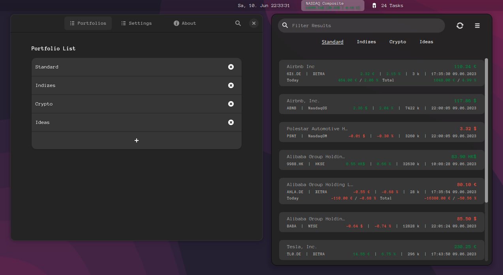
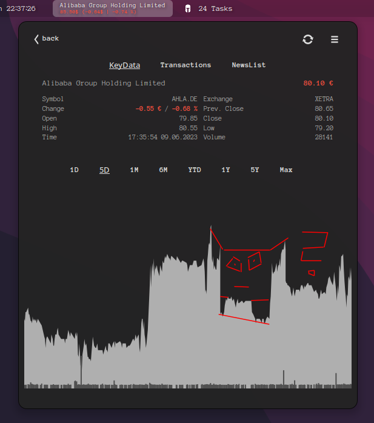
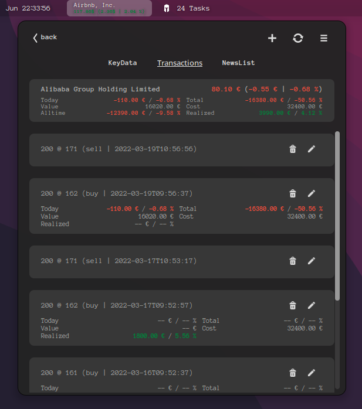

# [stocks-extension](https://extensions.gnome.org/extension/1422/stocks-extension/)

A extension to display stock quotes in GNOME Shell Panel

    

    
    

*stocks-extension* integrates stock quotes to your GNOME Shell Panel =)

----

## Installation

This extension is available in the [GNOME Shell Extension Directory](https://extensions.gnome.org/extension/1422/stocks-extension/).

### Manual Installation

#### Release Package
[Download](https://github.com/internetstaff/stocks-extension/releases) a release and put the content into `~/.local/share/gnome-shell/extensions/stocks@infinicode.de` (you need to create a directory).

#### Make install

Clone the repo and run `make install`

## Data Provider

Data is cached for no less than 5 minutes and will reload automatically. Click refresh to force a fresh pull immediately.

Supported stock providers:

 - [Yahoo Finance](https://finance.yahoo.com/)
 - [eastmoney](https://www.eastmoney.com/)

Supported cryptocurrency providers (public market-data APIs, no API key or extra package required):

 - [Binance](https://developers.binance.com/docs/binance-spot-api-docs/rest-api/market-data-endpoints) — symbol example: `BTCUSDT`
 - [CoinGecko](https://docs.coingecko.com/reference/coins-markets) — coin ID example: `bitcoin`
 - [Coinbase](https://docs.cdp.coinbase.com/api-reference/exchange-api/rest-api/products/get-product-stats) — product example: `BTC-USD`
 - [Upbit](https://global-docs.upbit.com/reference/ticker-current-price) — market example: `KRW-BTC`

Eastmoney is likely to be removed if I don't hear from users.

## Add Stocks or Coins

To add an item you need the provider-related symbol or identifier.

1. Open Settings
2. Add or Select a Portfolio
2. Click on the + icon on the bottom of the first tab
3. Choose **Stock** or **Coin** and select a provider
4. Enter the provider's symbol/ID and give it a name

### debug
dbus-run-session -- gnome-shell --devkit --wayland
